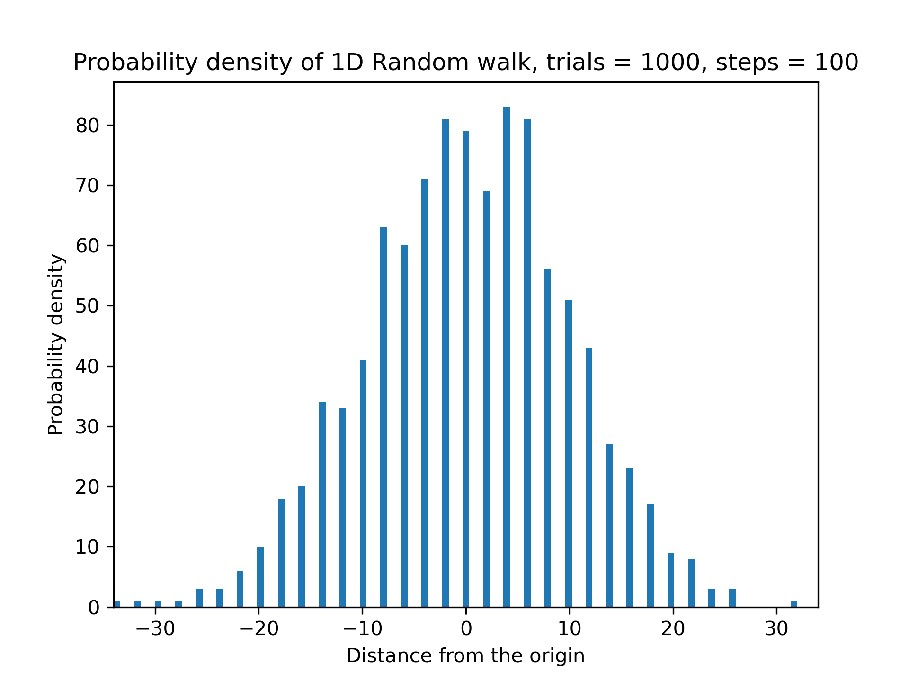
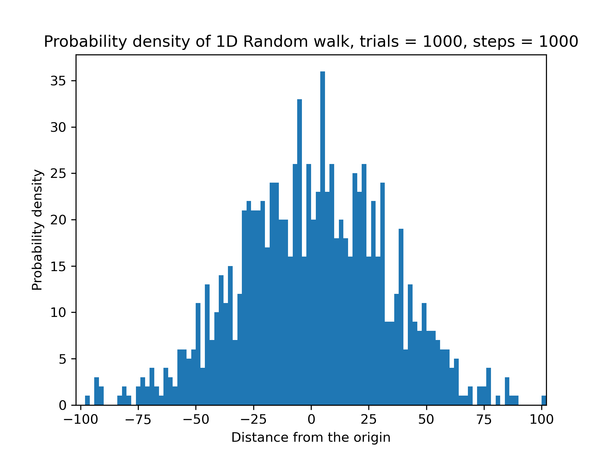
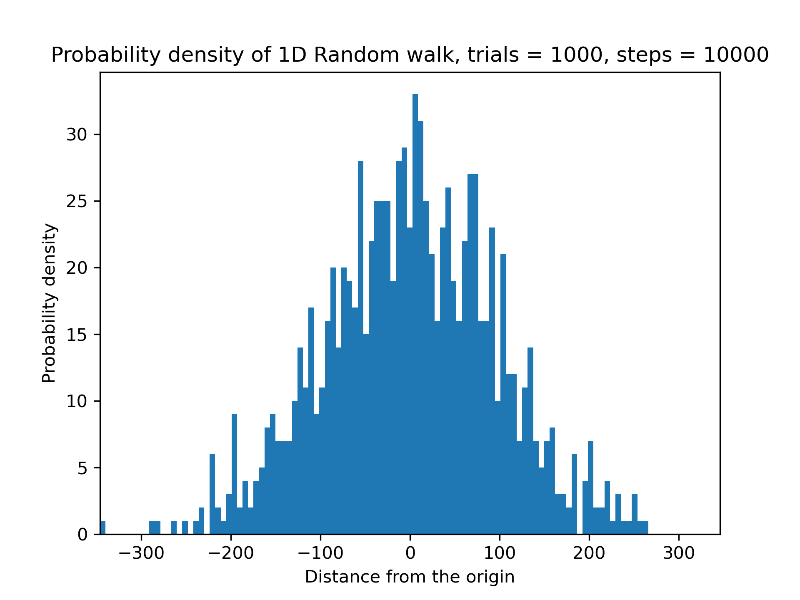
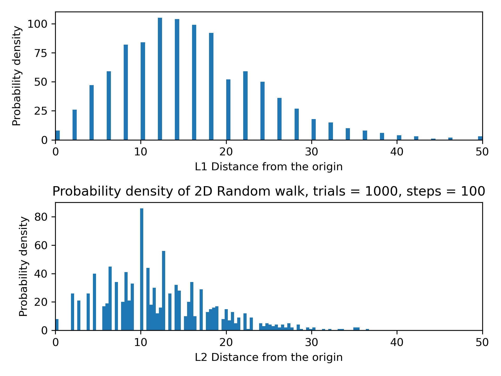
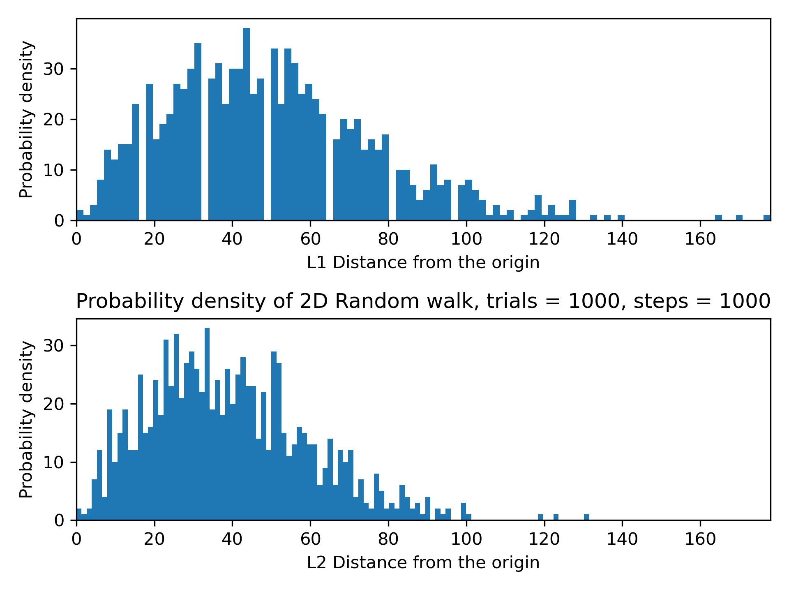
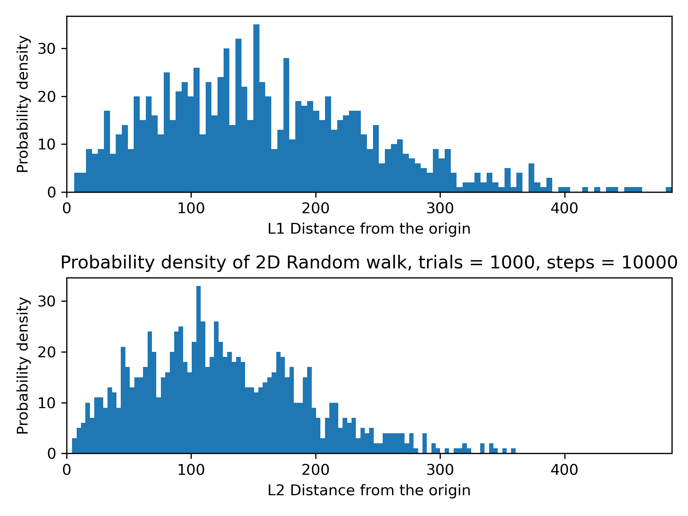
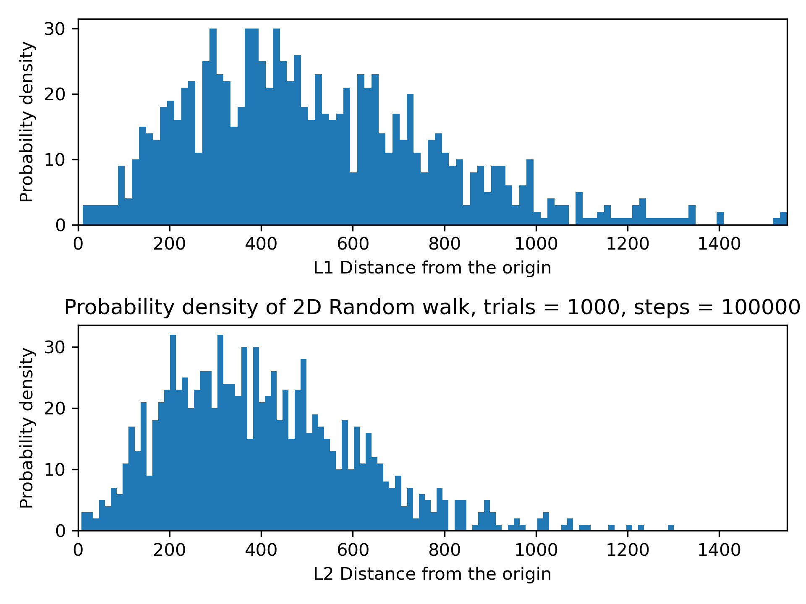

# Random Walk Simulation

## Simulation process (Use 2D case as example)

Import the packages

```python
import time
import numpy as np
import matplotlib.pyplot as plt
```

Define the function to randomly generate 1 & -1

```python
def generate_random_sign():
    n = random.choice([-1, 1])
    return n
```

Define the number of trials of simulation and the samples of random walks in the single trials

Calculate the L1 distance (Manhattan distance) and L2 distance (Euclidean distance)

$$
L1 = |x| + |y|
$$

$$
L2 = \sqrt{x^2+y^2}
$$

```python
num_trial, num_samples = 1000, 1000
pos_x, pos_y = 0, 0
l1_dist = []
l2_dist = []

for i in range(num_trial):
    x, y = 0, 0
    for i in range(num_samples):

        x1 = generate_random_sign()
        y1 = generate_random_sign()

        if x1 == 1:
            pos_x += 1
    
        if y1 == 1:
            pos_y += 1
        
        x += x1
        y += y1

    l1 = abs(x) + abs(y)
    l1_dist.append(l1)

    l2 = np.sqrt(x**2 + y**2)
    l2_dist.append(l2)
```

## 1D Cases

$1000\ trials, \ 100\ steps$

Positive percentage for x: 50.09 %

Calculation time: 0.0567 seconds

|  | Min distance | Max distance | Average distance | Standard Deviation |
| - | - | - | - | - |
| Distance | -34 | 32 | 0.18 | 9.85 |



---

$1000\ trials, \ 1000\ steps$

Positive percentage for x: 49.99 %

Calculation time: 0.6559 seconds

|  | Min distance | Max distance | Average distance | Standard Deviation |
| - | - | - | - | - |
| Distance | -98 | 102 | -0.27 | 32.3 |



---

$1000\ trials, \ 10000\ steps$

Positive percentage for x: 50.0 %

Calculation time: 5.9588 seconds

|  | Min distance | Max distance | Average distance | Standard Deviation |
| - | - | - | - | - |
| Distance | -346 | 266 | 1.0 | 96.36 |



---

$1000\ trials, \ 100000\ steps$


## 2D Cases

$1000\ trials, \ 100\ steps$

Positive percentage for x: 50.02 %

Positive percentage for y: 49.87 %

Calculation time: 0.121 seconds

|  | Min distance | Max distance | Average distance | Standard Deviation |
| - | - | - | - | - |
| L1 | 0 | 50 | 15.72 | 8.44 |
| L2 | 0.0 | 36.72 | 12.32 | 6.41 |



---

$1000\ trials, \ 1000\ steps$

Positive percentage for x: 49.99 %

Positive percentage for y: 49.93 %

Calculation time: 1.2107 seconds

|  | Min distance | Max distance | Average distance | Standard Deviation |
| - | - | - | - | - |
| L1 | 0 | 178 | 49.96 | 26.75 |
| L2 | 0.0 | 131.53 | 39.18 | 20.41 |



---

$1000\ trials, \ 10000\ steps$

Positive percentage for x: 50.01 %

Positive percentage for y: 49.98 %

Calculation time: 12.4793 seconds

|  | Min distance | Max distance | Average distance | Standard Deviation |
| - | - | - | - | - |
| L1 | 6 | 486 | 160.1 | 86.66 |
| L2 | 4.47 | 360.49 | 125.91 | 66.96 |



---
$1000\ trials, \ 100000\ steps$

Positive percentage for x: 50.0 %

Positive percentage for y: 50.0 %

Calculation time: 139.5256 seconds

|  | Min distance | Max distance | Average distance | Standard Deviation |
| - | - | - | - | - |
| L1 | 10 | 1548 | 513.23 | 270.38 |
| L2 | 7.21 | 1300.26 | 403.84 | 209.39 |



---

$1000\ trials, \ 1000000\ steps$

Positive percentage for x: 50.0 %

Positive percentage for y: 50.0 %

Calculation time: 3174.3449 seconds

|  | Min distance | Max distance | Average distance | Standard Deviation |
| - | - | - | - | - |
| L1 | 66 | 5214 | 1623.2 | 864.18 |
| L2 | 47.71 | 3782.29 | 1279.21 | 669.78 |

