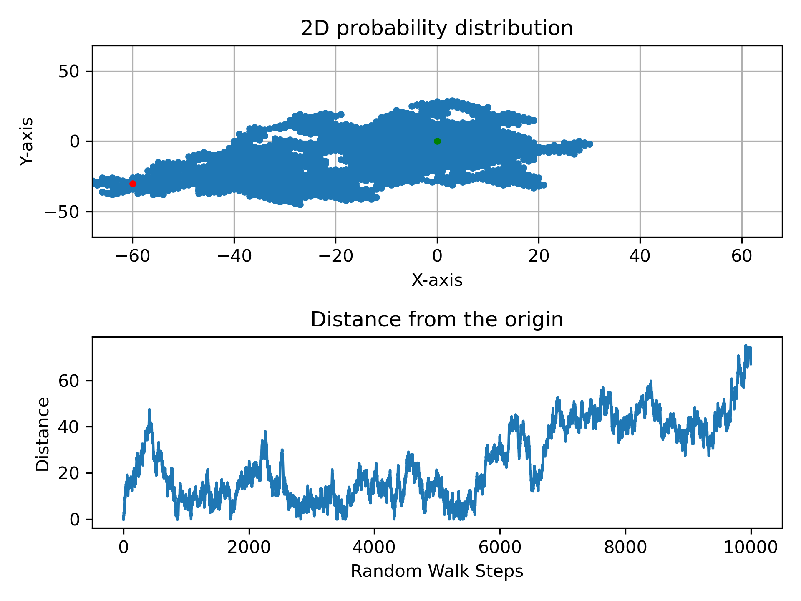

# Random Walk Simulation

## Simulation process (Use 2D case as example)

Import the packages

```python
import time
import numpy as np
import matplotlib.pyplot as plt
```

Define the function to randomly generate 1 & -1

```python
def generate_random_sign():
    n = random.choice([-1, 1])
    return n
```

Define the number of trials of simulation and the samples of random walks in the single trials

Calculate the L1 distance (Manhattan distance) and L2 distance (Euclidean distance)

$$
L1 = |x| + |y|
$$

$$
L2 = \sqrt{x^2+y^2}
$$

```python
num_trial, num_samples = 1000, 1000
pos_x, pos_y = 0, 0
l1_dist = []
l2_dist = []

for i in range(num_trial):
    x, y = 0, 0
    for i in range(num_samples):

        x1 = generate_random_sign()
        y1 = generate_random_sign()

        if x1 == 1:
            pos_x += 1
    
        if y1 == 1:
            pos_y += 1
        
        x += x1
        y += y1

    l1 = abs(x) + abs(y)
    l1_dist.append(l1)

    l2 = np.sqrt(x**2 + y**2)
    l2_dist.append(l2)
```

## 1D Cases


## 2D Cases

